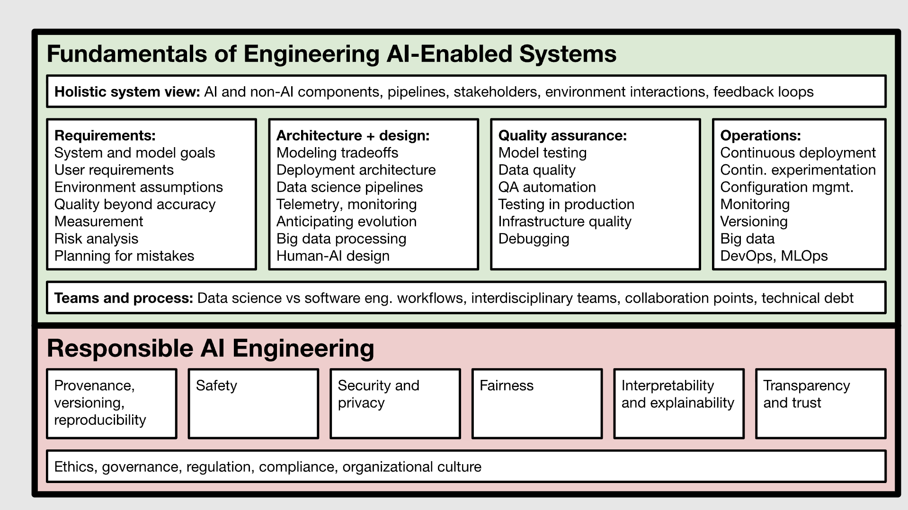

### Topics (work in progress): 

- Building and maintaining automated ML pipelines
- Designing training and inference workflows
- Databricks platform expertise
- MLflow (experiment tracking, model versioning, model registry)
- CI/CD implementation for ML/model code
- Model monitoring & observability (drift detection, performance monitoring, data quality checks)
- Model serving in production environments
- Data and model governance
- Unity Catalog (permissions management, data lineage, model lineage)
- ML lifecycle management
- Pipeline integration & orchestration
- Automation of testing and deployment System migration support
- End-to-end Machine Learning (ML) productionization

### Databricks

- [The Big Book of MLOps](https://blog.infocruncher.com/resources/ml-productionisation/The%20Big%20Book%20of%20MLOps%20(Databricks,%20v6,%202022).pdf)
- [MLOps workflows on Databricks](https://docs.databricks.com/aws/en/machine-learning/mlops/mlops-workflow)
- [Model deployment patterns](https://docs.databricks.com/aws/en/machine-learning/mlops/deployment-patterns)
- [Databricks Asset Bundles resources](https://docs.databricks.com/aws/en/dev-tools/bundles/resources)
- [GenAI](GenAI-Databricks.md)

### Resources

- [Designing machine learning systems](https://github.com/chiphuyen/dmls-book/blob/main/resources.md)
- [MLOps-Tools]()
- [IEEE MLOPS](https://ieeexplore.ieee.org/document/10081336)
- [CMU Machine Learning in Production](https://ckaestne.github.io/seai/)
